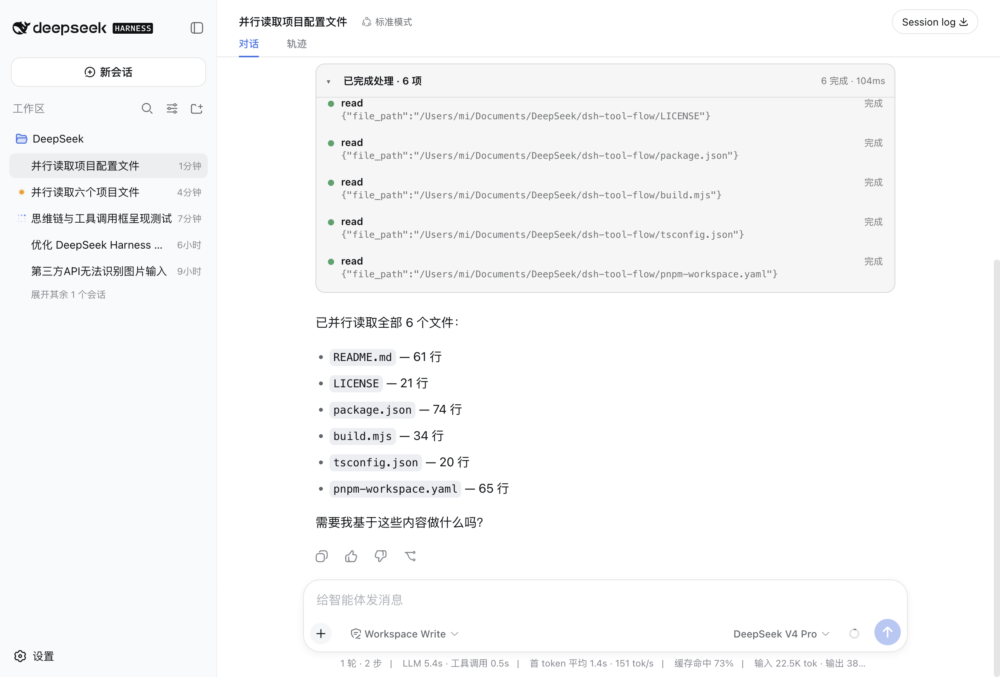

[English](./README.md) | [中文](./README.zh.md)

# dsh-tool-flow

一个 [DeepSeek Harness](https://github.com/deepseek-ai/deepseek-harness)（`dsh`）Web 客户端插件：把同一回合里的所有根工具调用 / 斜杠命令折叠成一张紧凑、可收起的轨迹卡片，并把助手回合的思维链（Think）、正文、图片与内嵌工具调用统一渲染。



## 为什么做这个

原版 DeepSeek Harness 的 Web 界面里，每一次工具调用、命令和结果都会在对话里各占一行。一个会连跑多个工具的 agent 回合，会把聊天流刷成几十条噪声——模型的推理被淹没，最终回答被顶出屏幕，「刚才到底发生了什么」得靠考古才能还原。

这个插件改变了这一点：它把每个回合的工具活动折叠成一张紧凑、可收起的卡片——运行中的调用带实时状态点并自动展开，结束后缩成一行摘要（数量、失败数、耗时）。模型的思维链变成整洁的可折叠「⌘ Think」行，回答终于读起来像回答。工具调用不再是噪声，而是一条你随时能展开的「一瞥即懂」的轨迹。

## 特性

- **按回合分组工具调用** —— 同一回合的根工具调用与斜杠命令收进一张卡片。
- **实时状态** —— 运行中的调用显示琥珀色圆点并自动展开、自动滚动；结束后折叠成一行摘要（数量、失败数、耗时）。
- **助手回合渲染** —— 思维链渲染成可折叠的「⌘ Think」行；正文走 harness 的 markdown 渲染器；图片走附件画廊；非根（嵌套）工具调用内联渲染。
- **保留原生详情** —— 每个调用仍可通过 harness 详情面板查看。

## 安装

构建 tarball 并添加到 web profile：

```sh
pnpm install
pnpm build
pnpm pack
dsh plugin --profile web add ./dsh-tool-flow-0.1.0.tgz
```

## 开发

```sh
pnpm install
pnpm typecheck   # tsc --noEmit
pnpm build       # esbuild 打包 + 输出类型声明
```

产物是纯客户端（浏览器 UI）。peer 依赖由 harness web 端提供：

- `@deepseek-ai/dsh-client-runtime`
- `@deepseek-ai/dsh-client-ui-conversation`
- `@deepseek-ai/dsh-client-ui-slots`
- `@deepseek-ai/dsh-client-ui-tool`
- `@deepseek-ai/dsh-client-ui-primitives`
- `@deepseek-ai/dsh-client-ui-attachment`

## 工作原理

插件注册了三个 `conversation.chat.node` 插槽：

| 节点类型 | 组件 | 行为 |
|-----------|-----------|----------|
| `tool-call` / `command` | `ActivityFlow` | 把同一回合连续的调用折成一张卡片。 |
| `assistant-step` | `AssistantMixed` | 渲染思维链 / 正文 / 图片 / 内嵌工具调用块。 |

## 许可证

[MIT](./LICENSE)
